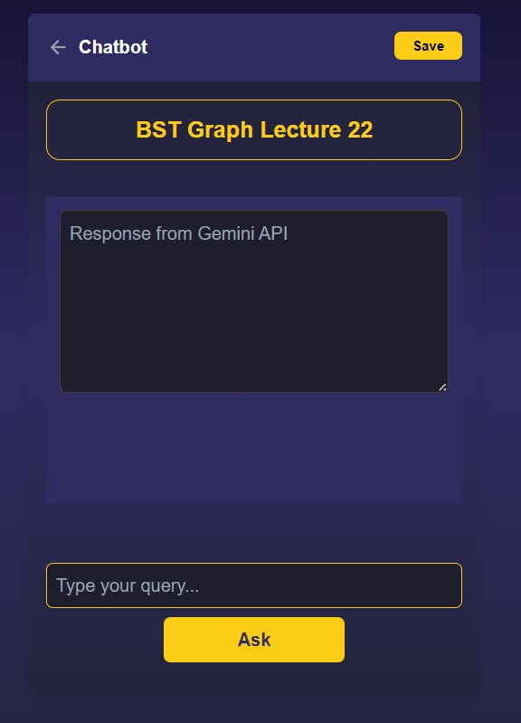
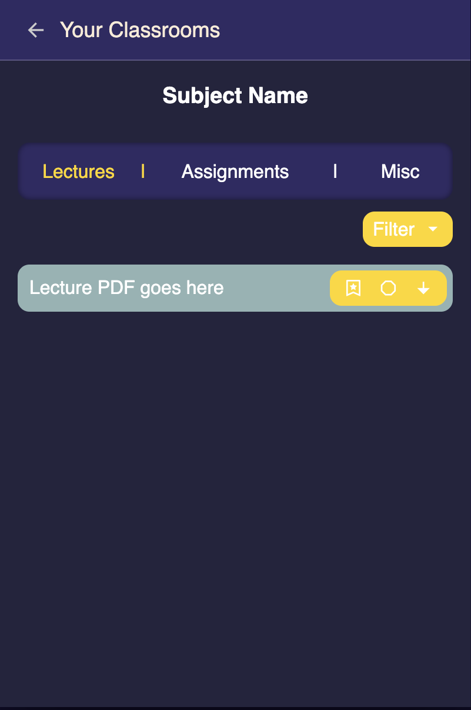
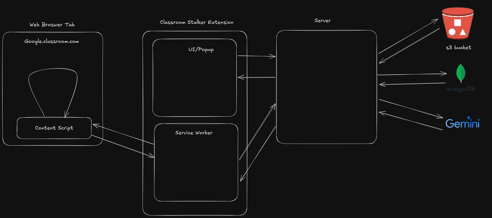

# CODEJAM V5

## Basic Idea

A Chrome Extension that processes all classroom content and classifies it into lectures, assignments, and announcements sections. It also allows users to add tags for classification and filtering based on lecture difficulty and exams (T1, T2, T3). Additionally, a chatbot feature is included, which can summarize content, clear doubts, and assist with lecture-related queries. User will also be able to save notes regarding some lectures if they want to.

## Tech Stack

- **React**: Frontend components
- **Tailwind CSS**: Styling
- **Vite**: Build tools and configuration
- **Express and Node.js**: Backend
- **MongoDB Atlas**: Database
- **AWS S3 Bucket**: For storing lectures
- **Langchain(Expected)**: RAG-based Chatbot using Gemini API

## Expected Frontend Screens

- Sign-Up and Login Screen
- Home Screen
- Lecture Screen
- Chatbot Screen
- Notes Screen

## Expected Backend Functionality

- **Authentication Routes**: Login and Sign-Up
- **User Information Routes**:
  - Processed classroom information
  - Saved chats
- **Chatbot Functionality**: Provide streamed responses using Gemini.
- **Notes Functionality**: CRUD on Notes for each lectures.
- **Handle Lecture Upload**: recieve and upload lectures to S3 and save details to database.

## Expected Content Script Work

- **Scrap the classroom course data**: Scrap the links of the lectures and send it to the server
- **Simple UI**: UI Button and status to inform user of processing.

## Features

### Features Implemented as of 8:30 PM, 25th of Dec, 2024

- Signup/Login completed end to end.
- Able to process the lectures links from the classroom, download them and save them to s3 bucket through server, and store the lectures and course details in the database.
- Implemented UI components for chatbot and lectures classification Screens.

#### Demo Videos

`Description of the Video`: Ability of the extension to process and save data to backend and display it on the popup screen of extension.

`Video Link`: https://github.com/HarshSharma20503/CodeJam-v5/blob/main/Classroom%20Stalker.mp4

`Description of the Video`: Sign up for first user, only users with `@mail.jiit.ac.in` are allowed. If no course are processed. It wiil show you instructions as to how to process them.

`Video Link`: https://github.com/HarshSharma20503/CodeJam-v5/blob/main/signup.mp4

#### Screenshots

`Screenshots of the implemented UI that is yet to be integrated`
<div style="display: flex; justify-content: space-between;">
   
   
</div>

### Features Planned for the hackathon

- Working Chatbot, with whom you can ask doubts about your lecture that you have selected. Save Chats if need be.
- Filter the lectures according to the tags that you have created. Add tags too obviously.
- Create and save notes for the lecture you have selected.

### Features that can be added

- Notes and can be shared through a link.
- Rewriting responses and better chatbot UI.

## Basic Architecure and data flow



## Steps to Run the Project

### 1. Clone the Repository

Run the following command in your terminal to clone the repository locally:

```bash
git clone https://github.com/HarshSharma20503/CodeJam-v5.git
```

Now navigate to the project using the following command:

```bash
cd CodeJam-v5
```

### 2. Set Up the Backend

1. Navigate to the backend directory:

   ```bash
   cd backend && npm install
   ```

2. Create a `.env` file in the backend directory:

   ```bash
   touch .env
   ```

3. Copy the contents of the `.env.example` file into `.env`.
4. Set up a MongoDB server and obtain the `Mongo_URI`. Paste the URI into the `.env` file.
5. Ensure the `.env` file contains the valid credentials.
6. Start the backend server:

   ```bash
   npm run dev
   ```

### 3. Set Up the Frontend

1. Open a new terminal and navigate to the frontend directory:

   ```bash
   cd frontend
   ```

2. Build the frontend to create the `dist` folder:

   ```bash
   npm install && npm run build
   ```

### 4. Add the Extension to the Browser

1. Open your browser and navigate to the extensions page:
   - For Chrome: `chrome://extensions`
   - For Brave: `brave://extensions`
2. Enable **Developer Mode** (usually found in the top right corner).
3. Click on **Load Unpacked**.
4. Select the `dist` folder generated in the frontend directory.
5. The extension is now added and ready to use.

### 5. Using the Extension

1. Sign up with an email that uses the `@mail.jiit.ac.in` domain.
2. Log in and start using the extension features.

---

## Notes

- Ensure backend server is running.
- The backend runs on port 8000 by default. Ensure there are no conflicts.
- For troubleshooting, ensure MongoDB is running and accessible.
